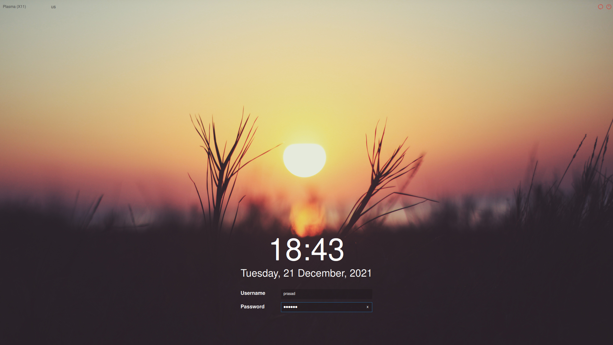

# Arch_Linux_Custom_ISO

### Here is a customized Arch Linux ISO, with graphical installer(Calamares).
### It is built with the help of ArchIso package provided by Arch Linux.

### Here is a link to the guide:-
<a>https://wiki.archlinux.org/title/Archiso</a>

### Link to the ISO :-
<a>https://www.mediafire.com/file/2jpum73yli9htlx/Arch-Linux-KDE-2021.12.21-x86_64.iso/file</a>

### 1. Arch Linux
### 2. Calamares Installer
### 3. KDE Plasma Desktop Environment
### 4. Latte Dock
### 5. Customized Sweet KDE theme
### 6. Starship Prompt
### 7. Aur Support with Yay and Pamac

### Steps for installation:-
1. Download and flash the ISO.
2. Boot into the live environment (ISO).
3. Default Username => arch Password => arch
4. Root Username => root Password => root.
5. Login using any of the above two users.
6. Run Calamares Installer.
7. Follow the steps and set new username and password.
8. After the setup restart the system and Arch Linux is installed.

### Default Login Credentials:-
1. User :- arch
   Password:- arch

2. User :- root
   Password :- root

### Screenshots :-
 

